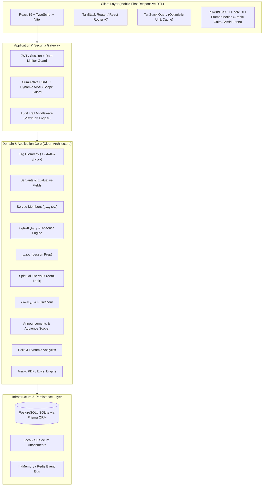

# Implementation Plan: Church Service (خدمة) Management System

An enterprise-grade, mobile-first, RTL-native Church Service Management System built to the highest engineering and security standards. Designed with Clean Architecture / Domain-Driven Design (DDD), strict cumulative Role/Attribute-Based Access Control (RBAC + ABAC), dynamic extensible schemas, zero-leak privacy vaults, and an ultra-modern luxury Arabic UI.

---

## System Architecture & Technical Decisions



### Technology Stack
- **Backend / Core Engine**: Node.js v24 (LTS) with TypeScript, Express/Fastify modular micro-service ready monolith, Prisma ORM for type-safe database access with strict referential integrity.
- **Frontend / Client**: React 19, TypeScript, Vite, Tailwind CSS with full native RTL (`dir="rtl"`) styling, Lucide Arabic icons, Cairo & Amiri typography, Radix UI headless accessibility primitives, and Framer Motion micro-interactions.
- **Database**: SQLite (for instant local zero-dependency development) with direct seamless migration capability to PostgreSQL via Prisma.
- **Security & Validation**: Zod schema validation on every request, Argon2id/bcrypt password hashing, AES-256-GCM encryption for sensitive fields, strictly isolated spiritual vault, and automated audit logging.
- **Reporting & Export**: `exceljs` with Arabic styling; `@react-pdf/renderer` or `pdfmake` with shaped Arabic fonts (Amiri/Cairo) for PDF generation.

---

## User Review Required

> [!IMPORTANT]
> **SRS Assumptions Confirmed for Implementation**:
> 1. **(A1) Evaluation Chain**: Evaluative fields for خادم/مساعد are set by امين الخدمة; for امين الخدمة by امين قطاع; for امين قطاع by امين عام.
> 2. **(A2) Servant Entry on Assigned Members**: Servants (خدام) can edit the 3 evaluative fields (الحالة المادية، سلوكه، اندماجه) for their *assigned* مخدومين only.
> 3. **(A3) General Secretary**: امين عام has an identity profile without evaluative fields.
> 4. **(A4) Follow-up Matrix**: Assistant follow-up matches servant follow-up (+ الأنشطة). Stage Secretary adds اجتماع الأمناء; Sector Secretary adds اجتماع أمناء المراحل.
> 5. **(A5) Announcement Authority**: Composing announcements starts at امين الخدمة and above, targeted downward or to peers within scope, never upward.
> 6. **(A6 & A7)** Single organization scope for Phase 1 with dynamic stages; accounts provisioned by authorized secretaries (no public signup).

> [!TIP]
> **Extensibility & Dynamic Configuration**:
> - Stages (مراحل) and Sectors (قطاعات) are dynamic database entities with configurable age bands, gender splits, and metadata.
> - Follow-up item types (قداس، تحضير، خدمة، افتقاد...) are extensible checklist definitions rather than rigid hardcoded enums.

---

## Proposed Implementation Phases & Granular Task Division

### Phase 0: Project Scaffolding, Tooling & Monorepo Foundation
- [ ] Initialize workspace structure (clean separation: `client/`, `server/`, `shared/` for common types & DTOs).
- [ ] Configure TypeScript `tsconfig.json` with strict type checking (`noImplicitAny`, `strictNullChecks`).
- [ ] Setup ESLint, Prettier, and environment configuration (`dotenv` + Zod env validator).
- [ ] Configure Vite + React + Tailwind CSS with native RTL directionality and Arabic typography (Cairo font).
- [ ] Setup testing infrastructure (Vitest for unit/integration tests, Playwright for E2E testing).

### Phase 1: Database Architecture, Prisma Schemas & Seed Data
- [ ] Model core organizational entities in Prisma: `Sector` (قطاع), `Stage` (مرحلة).
- [ ] Model user entity: `User` (Servant profile, role enum: `SERVANT`, `ASSISTANT_SECRETARY`, `STAGE_SECRETARY`, `SECTOR_SECRETARY`, `GENERAL_SECRETARY`, scope IDs, status).
- [ ] Model `EvaluativeRecord` with historical versioning and author tracking.
- [ ] Model `ServedMember` (مخدوم), assignment mappings, and guardian/family metadata.
- [ ] Model `FollowUpRecord` (جدول المتابعة) polymorphic attendance items per session/date.
- [ ] Model `LessonPrep` (تحضير), attachments, and review status.
- [ ] Model `SpiritualLifeEntry` with strict privacy flags.
- [ ] Model `YearPlanItem` (تدبير السنة), calendar events, and servant signups.
- [ ] Model `PrivateNote` with hierarchical visibility rules.
- [ ] Model `Poll`, `PollOption`, and `PollVote`.
- [ ] Model `Announcement`, target audience criteria, and read receipts.
- [ ] Model `Notification` and `NotificationPreference`.
- [ ] Model `AuditLog` (immutable audit trail for security and sensitive data access).
- [ ] Create comprehensive database seed script with sample Coptic Orthodox church structure (حضانة, ابتدائي 1-2, ابتدائي 3-4, ابتدائي 5-6, اعدادي بنين/بنات, ثانوي بنين/بنات, جامعة), sectors, test accounts for all 5 roles, and mock members.

### Phase 2: Security Core, Authentication & Cumulative RBAC/ABAC Engine
- [ ] Implement secure authentication: Login by phone number or email + password.
- [ ] Session management / JWT issuance with secure HTTP-only cookies and refresh token rotation.
- [ ] Password reset flow with OTP simulation/email dispatch.
- [ ] Create cumulative permission engine:
  - Base role matrix evaluator (`can(user, action)`).
  - Scope resolver (`isWithinScope(user, targetEntity)`: org-wide vs sector vs stage vs assigned).
  - Downward authority check (`isNotSuperiorToAuthor(author, recipient)`).
- [ ] Create server middleware guards: `requireAuth`, `requirePermission(action)`, `requireScope(scopeExtractor)`.
- [ ] Create Rate Limiting middleware on authentication and sensitive endpoints.
- [ ] Implement automatic audit logger for every sensitive data mutation and export.

### Phase 3: Servant (خدام) Core Management & Transfer/Suspension Workflow
- [ ] CRUD API for servants scoped by secretary role (Stage Secretary manages stage servants, Sector Secretary manages sector, General Secretary manages all).
- [ ] Self-profile API: Allow servants to view and edit only their own non-evaluative fields (name, phone, address, confessor, marital status, education/job, children).
- [ ] Evaluative fields API: Strictly enforce that only the designated superior can update financial status, behavior, cooperation, and individual initiative.
- [ ] Servant transfer & suspension workflow (restricted to امين عام): Transfer between stages/sectors, account suspension/reactivation, with full history logging (`TransferHistory`).
- [ ] Supervisor private notes API: Add/view notes strictly scoped to the reporting chain (hidden from subject and peers).

### Phase 4: Served Members (مخدومين) Management & High-Speed Bulk Import
- [ ] CRUD API for served members (مخدومين) scoped to مساعد and above within their stage.
- [ ] Servant limited edit API: Allow assigned خادم to update only the 3 evaluative fields (الحالة المادية، سلوك الخدمة، الاندماج).
- [ ] Served member assignment/reassignment engine (assigning children to one or more servants).
- [ ] High-speed bulk import service: Parse Excel (`.xlsx`) and CSV files, validate schema, map columns, report validation errors per row, and perform atomic batch insertion.
- [ ] Search, filter, and pagination system (by stage, servant, attendance health, keyword).

### Phase 5: Attendance & Follow-up Tracking (جدول المتابعة) & Absence Alert Engine
- [ ] Dynamic session schedule generator (weekly mass, Sunday school service, service meetings, activities).
- [ ] Attendance recording API for both servants and served members:
  - Servant follow-up (القداس، التحضير، الخدمة، الافتقاد، اجتماع الخدمة، اجتماع الصلاة، الأنشطة، اجتماع الأمناء، اجتماع أمناء المراحل).
  - Served member follow-up (القداس، الخدمة، الافتقاد، نادي/رحلة/مؤتمر).
- [ ] Read-only view enforcement: Servants and served members can only view their own attendance records.
- [ ] Rolling attendance summary analytics engine (% attendance over 4, 8, and 12 weeks).
- [ ] Consecutive absence detection engine (configurable threshold, default 2 consecutive absences) triggering automatic alerts to the responsible خادم and امين الخدمة.

### Phase 6: Lesson Preparation (تحضير) Module
- [ ] Lesson prep submission API: Title, stage, biblical reference, objectives, lesson content, and optional file attachments.
- [ ] Lesson prep review and feedback API for امين الخدمة and higher within scope.
- [ ] Prep deadline reminder system (scheduled notifications before weekly service).
- [ ] Searchable curriculum archive of historical preps.

### Phase 7: Spiritual Life Vault (حياة روحية) — Zero-Leak Security
- [ ] Private spiritual life logging API: Communion (تناول), Confession (اعتراف), and Prayer (صلاة) tracking.
- [ ] Zero-Leak database isolation: Ensure spiritual life tables are strictly excluded from general queries, admin dashboards, analytics aggregates, and report exports.
- [ ] Personal private trend visualization for the individual servant only.

### Phase 8: Annual Ministry Plan (تدبير السنة) & Interactive Calendar
- [ ] Year plan management API: Create, edit, and organize curriculum topics, trips (رحلات), conferences (مؤتمرات), and seasonal events.
- [ ] Servant opt-in/signup mechanism: Servants can volunteer or sign up for specific roles/activities.
- [ ] Stage-level servant posting API (FR-7.4): Servants can post updates/items visible exclusively within their stage without modifying the official master plan.
- [ ] Interactive Calendar View: Monthly, weekly, and agenda views filtered dynamically by user scope and stage.

### Phase 9: Private Notes, Polls & Real-Time Tallies
- [ ] Confidential supervision notes with immutable timestamps and hierarchical visibility checks.
- [ ] Poll creation engine: Scoped by stage, sector, or organization, with deadlines and multi-choice options.
- [ ] Anonymous or identified voting engine preventing duplicate votes.
- [ ] Real-time vote aggregation and visualization for poll creators.

### Phase 10: Announcements Hub & Multi-Channel Notification Dispatcher
- [ ] Announcement authoring API with strict downward/peer recipient filter (FR-10.2).
- [ ] Recipient resolution engine: Target specific stages, sectors, roles, or individual users.
- [ ] In-app notification center: Unread counters, mark as read, priority badges.
- [ ] Multi-channel notification adapter (Push notifications, simulated SMS & Email dispatch with user channel preferences).

### Phase 11: Executive Dashboards & Hierarchical Analytics
- [ ] Dynamic role-scoped dashboard widgets:
  - **خادم**: Personal attendance trends, assigned مخدومين status, upcoming prep deadlines, spiritual life chart.
  - **مساعد**: Stage مخدومين attendance % rates, missing visits (افتقاد), active alerts.
  - **امين الخدمة**: Stage overview, servants attendance health, prep submission rate %, consecutive absence warnings, poll metrics.
  - **امين قطاع**: Sector-wide cross-stage comparative analytics, secretary meeting attendance.
  - **امين عام**: Comprehensive organization-wide metrics, distribution charts, activity trends.
- [ ] Responsive interactive charts (Recharts / Chart.js) formatted with Arabic numerals and labels.

### Phase 12: Arabic PDF & Excel Report Generator & Audit Vault
- [ ] High-fidelity Excel exporter (`exceljs`):
  - Formatted RTL Arabic sheets with custom cell styles, headers, and formulas.
  - Export attendance sheets, member rosters, and annual summaries.
- [ ] Beautiful Arabic PDF report generator:
  - Custom RTL layout engine with proper Arabic text shaping and font embedding (Amiri/Cairo).
  - Individual servant profile + attendance history report.
  - Comprehensive stage and sector performance reports.
- [ ] Export security guard: Automatic masking of sensitive minor information unless explicitly permitted by scope, and logging every export event in `AuditLog`.

### Phase 13: Luxury Mobile-First RTL Arabic UI & Micro-Interactions
- [ ] Design System & Theme: Deep royal indigo (`#0F172A`), rich gold accents (`#D97706`), warm emerald indicators (`#059669`), sleek dark/light mode toggle.
- [ ] Mobile navigation: Bottom navigation bar for mobile, collapsible sidebar for desktop, top bar with notifications and user profile.
- [ ] Fast Attendance Entry UI: Tinder-style / rapid-tap checklist for taking attendance in under 30 seconds during Sunday school.
- [ ] Mobile-first responsive forms with instant validation and smooth transitions.
- [ ] Skeleton loaders, empty state illustrations, and toast notifications.

### Phase 14: Verification, Security Hardening, E2E Testing & Documentation
- [ ] Comprehensive automated test suite:
  - Unit tests for RBAC/ABAC scope resolution and absence alert calculations.
  - Integration tests for auth, CRUD operations, and permission boundary enforcement.
  - E2E tests verifying complete user journeys across all 5 roles.
- [ ] Security vulnerability scan (OWASP Top 10 checklist verification, SQL injection protection, XSS filtering, CORS headers).
- [ ] Comprehensive Arabic and English User Guide & API documentation.

---

## File Structure Plan

```text
church-system/
├── package.json
├── tsconfig.json
├── shared/
│   ├── types/               # Shared TypeScript interfaces & enums
│   └── constants/           # Hierarchy definitions & permission matrices
├── server/
│   ├── prisma/
│   │   ├── schema.prisma    # Complete Prisma schema
│   │   └── seed.ts          # Comprehensive Coptic Church seed data
│   ├── src/
│   │   ├── config/          # Environment & security config
│   │   ├── core/            # Domain entities & business rules
│   │   ├── middleware/      # Auth, RBAC, Scope, Audit, RateLimiter
│   │   ├── modules/
│   │   │   ├── auth/        # Login, password reset, token handling
│   │   │   ├── hierarchy/   # Sectors, stages management
│   │   │   ├── servants/    # Servant profiles, evaluative fields, transfers
│   │   │   ├── members/     # Served members, assignments, bulk import
│   │   │   ├── follow-up/   # Attendance tables, sessions, absence alerts
│   │   │   ├── prep/        # Lesson preparations & reviews
│   │   │   ├── spiritual/   # Zero-leak spiritual life vault
│   │   │   ├── year-plan/   # Annual plan & calendar events
│   │   │   ├── notes/       # Confidential notes
│   │   │   ├── polls/       # Polls & voting tallies
│   │   │   ├── announcements/# Scoped announcements & notifications
│   │   │   ├── analytics/   # Scoped dashboard analytics
│   │   │   └── reports/     # Arabic PDF & Excel generation engine
│   │   └── app.ts           # Server initialization
└── client/
    ├── index.html
    ├── src/
    │   ├── assets/          # Arabic fonts & media
    │   ├── components/      # UI component library (Buttons, Cards, Modals, RTL Drawer)
    │   ├── context/         # AuthContext, NotificationContext, ThemeContext
    │   ├── hooks/           # useAuth, usePermission, useScope
    │   ├── pages/           # Pages for all modules & role views
    │   ├── services/        # API client with Axios / Fetch
    │   ├── styles/          # Tailwind & custom CSS for Arabic RTL
    │   └── App.tsx
```

---

## Verification Plan

### Automated Tests
- **Unit Tests**:
  - Test permission matrix against all 5 roles across 100+ distinct permission-scope scenarios.
  - Test absence detector threshold calculation (e.g., 2 consecutive missed weeks triggers alert).
  - Test spiritual life vault query isolation (verify zero leakage into general analytics).
- **Integration Tests**:
  - Test servant profile updates: non-evaluative fields allowed, evaluative fields blocked unless by superior.
  - Test bulk member import with valid and invalid Excel/CSV data.
  - Test announcement authoring: ensure sending to higher roles returns 403 Forbidden.
- **E2E & Build Tests**:
  - `npm run test` across all workspaces.
  - `npm run build` validating zero TypeScript or bundler errors.

### Manual Verification Flow
- Role-switching simulation: Log in as `خادم`, `مساعد`, `امين الخدمة`, `امين قطاع`, and `امين عام` to verify UI adapts dynamically and enforces strict security.
- Rapid attendance tracking test on simulated mobile viewport (iPhone / Android dimensions).
- Generate and inspect Arabic PDF & Excel reports to verify correct text shaping, font rendering, and layout.
